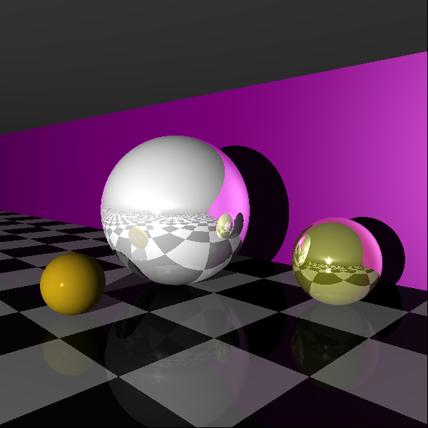
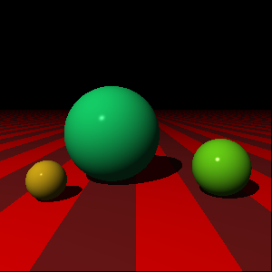
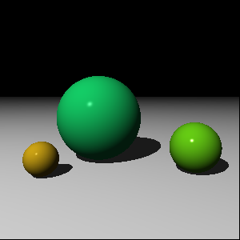
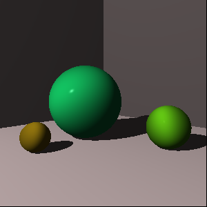

Reflections (so shiny) - Feb 15th 2026, 1:10 AM:

Patterns! (some refactoring was done) - Feb 13th 2026, 12:10 AM:

Fixed lighting normals - Feb 10th 2026, 11:25 AM:

Shadows are pretty simple - Feb 10th 2026, 2:36 AM:

Rendering a collection of objects - Feb 10th 2026, 2:11 AM:

Phong Lighting rewritten in Go - Feb 8th 2026, 11:09 PM:

Phong Lighting in Zig - Feb 8th 2026, 2:03 AM:

Raycasting in Zig - Feb 7th 2026, 10:28 PM:

